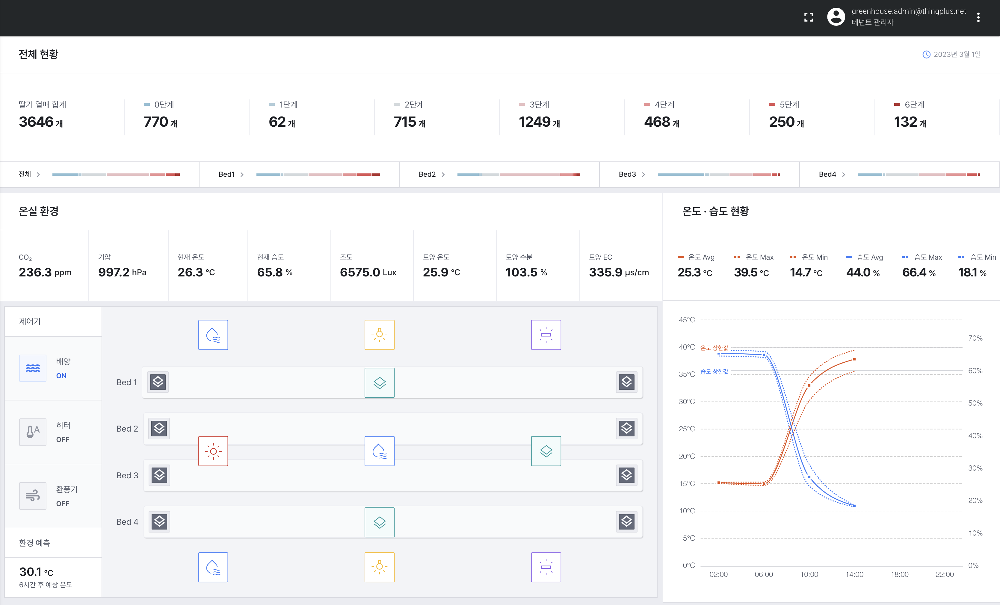
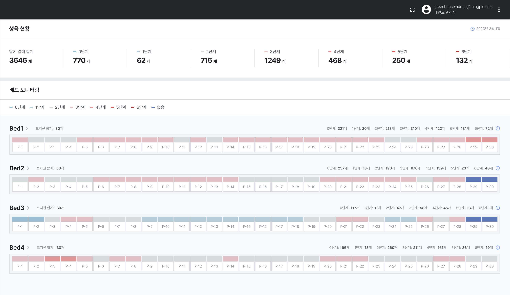
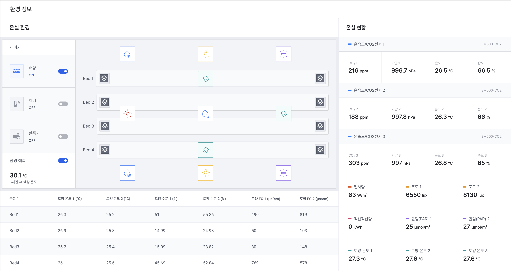
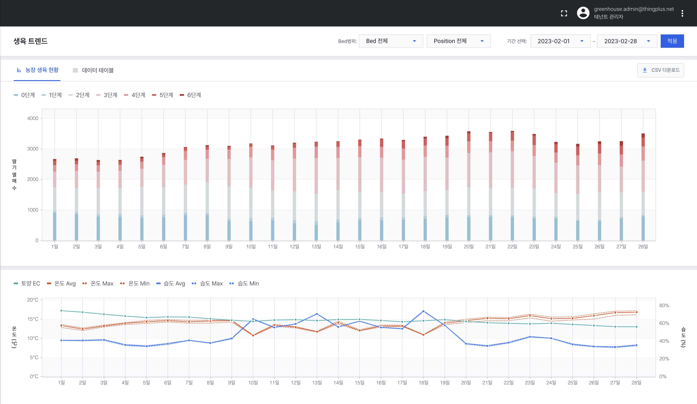
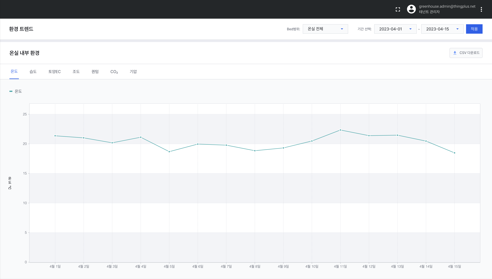
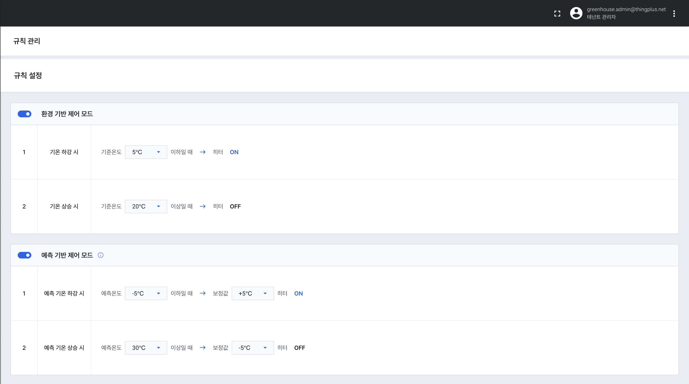

<h1 align="center">Welcome to DWAIoTFarmMonitoring 👋</h1>

  

> This project is for farm monitoring

## Link

👉 https://greenhouse.thingplus.net

## Author

👤 **Daliworks**

## Preview

👉전체 현황

  

---

👉생육 현황

  

---

👉환경 정보

  

---

👉생육 트렌드

  

---

👉환경 트렌드

  

---

👉규칙 관리

  

## Show your support

Give a ⭐️ if this project helped you!

---

_This README was generated with ❤️ by [readme-md-generator](https://github.com/kefranabg/readme-md-generator)_
